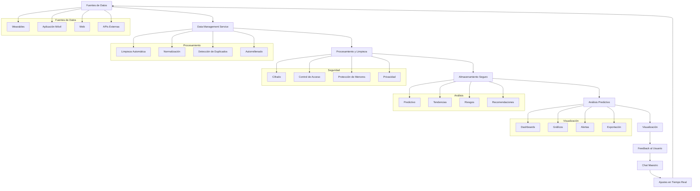

# Sistema de Gestión de Datos - "La Sangre de Spartan"

## Visión General

El Sistema de Gestión de Datos "La Sangre de Spartan" es la infraestructura central que nutre todo el ecosistema SPARTAN 4. Este sistema robusto, escalable y seguro integra todos los módulos, procesa datos en tiempo real, y proporciona inteligencia predictiva para optimizar la experiencia del usuario.

## Arquitectura del Sistema

### Componentes Principales

1. **Data Management Service** (`data-management-service.ts`)
   - Orquestador central de todos los datos del ecosistema
   - Sincronización en tiempo real de múltiples fuentes de datos
   - Generación de insights y análisis predictivo

2. **Data Processing Engine** (`data-processing-engine.ts`)
   - Limpieza y normalización automática de datos
   - Detección y eliminación de duplicados
   - Autorrellenado inteligente basado en patrones históricos
   - Calificación de calidad de datos

3. **Real-Time Data Integration** (`real-time-data-integration.ts`)
   - Integración de datos en tiempo real entre módulos
   - Sistema de eventos para actualizaciones instantáneas
   - Resolución de conflictos y mantenimiento de consistencia

4. **Data Security & Privacy** (`data-security-privacy.ts`)
   - Protección de datos sensibles mediante cifrado
   - Control de acceso y cumplimiento de privacidad
   - Protecciones especiales para menores de edad
   - Detección de indicadores de trastornos alimenticios

5. **Data Visualization Service** (`data-visualization-service.ts`)
   - Generación de dashboards interactivos
   - Visualización de tendencias y métricas clave
   - Exportación de datos en múltiples formatos

## Funcionalidades Clave

### 1. Integración Total

El sistema integra automáticamente todos los registros, métricas y feedback de cualquier módulo:

- **Entrenamiento**: Planes, sesiones, progresos
- **Nutrición**: Registros alimenticios, metas nutricionales
- **Recuperación**: Métricas de sueño, HRV, estrés
- **Progresión**: Carga, adaptaciones, hitos
- **Hábitos**: Seguimiento de rutinas y comportamientos
- **Wearables**: Datos biométricos en tiempo real

### 2. Limpieza y Normalización Automática

El Data Processing Engine se encarga de:

- **Detección de inconsistencias**: Identifica valores fuera de rango
- **Eliminación de duplicados**: Mantiene registros únicos
- **Corrección automática**: Aplica fixes para datos comunes
- **Calificación de calidad**: Evalúa la integridad de los datos

### 3. Autorrellenado Inteligente

- **Patrones históricos**: Completa campos basados en datos anteriores
- **Reducción de redundancias**: Evita solicitudes repetidas de información
- **Experiencia fluida**: Minimiza la entrada manual de datos

### 4. Captura de Datos Biométricos en Tiempo Real

- **Procesamiento instantáneo**: Lecturas de wearables en milisegundos
- **Detección de tendencias**: Identifica patrones en datos biométricos
- **Alertas de recuperación**: Notifica cuando se necesita descanso
- **Estado de fatiga**: Evalúa el nivel de fatiga en tiempo real

### 5. Análisis Predictivo

- **Proyecciones de rendimiento**: Anticipa mejoras en fuerza y resistencia
- **Riesgo de lesión**: Identifica factores que aumentan el riesgo
- **Nivel de energía**: Predice disponibilidad energética
- **Adherencia al plan**: Evalúa la probabilidad de cumplimiento

### 6. Conexión entre Modales

- **Sincronización perfecta**: Todos los modales comparten datos en tiempo real
- **Ajustes automáticos**: Cambios en un modal afectan a otros
- **Consistencia**: Una sola fuente de verdad para todos los datos

### 7. Visualización Inteligente

- **Dashboards interactivos**: Interfaces personalizadas por usuario
- **Tendencias claras**: Gráficos que muestran evolución
- **Alertas visuales**: Indicadores de progreso y riesgos
- **Recomendaciones accionables**: Insights convertidos en acciones

### 8. Seguridad y Privacidad

- **Cifrado de extremo a extremo**: Protección de datos sensibles
- **Control de acceso**: Autenticación y autorización robusta
- **Protecciones para menores**: Restricciones especiales para usuarios <18
- **Detección de TCA**: Identificación de patrones de trastornos alimenticios

### 9. Feedback Automático Basado en Datos

- **Respuestas inmediatas**: Cada registro genera feedback contextual
- **Ajustes proactivos**: Modificaciones antes de problemas
- **Recomendaciones personalizadas**: Sugerencias basadas en datos del usuario

### 10. Escalabilidad y Aprendizaje Continuo

- **Arquitectura modular**: Fácil integración de nuevas métricas
- **Adaptación continua**: El sistema aprende de nuevos datos
- **Expansión sin fricciones**: Incorporación de wearables y fuentes externas

## Flujo de Datos



## Tecnologías y Herramientas

### Almacenamiento

- **LocalStorage**: Para datos temporales y cache
- **Supabase**: Base de datos en la nube para persistencia
- **SQLite**: Base de datos local para desarrollo

### Procesamiento

- **TypeScript**: Tipado estricto para prevención de errores
- **Node.js**: Entorno de ejecución del lado del servidor
- **Algoritmos ML**: Para análisis predictivo (futuras implementaciones)

### Seguridad

- **JWT**: Autenticación segura
- **AES-256**: Cifrado de datos sensibles
- **OAuth 2.0**: Integración con servicios externos

### Visualización

- **Chart.js**: Gráficos interactivos
- **D3.js**: Visualizaciones avanzadas
- **React**: Interfaces de usuario dinámicas

## Casos de Uso

### 1. Entrenamiento Personalizado

```
Usuario completa entrenamiento → Datos se envían al sistema → 
Sistema analiza rendimiento → Ajusta plan para próxima sesión → 
Notifica al usuario de mejoras y recomendaciones
```

### 2. Nutrición Adaptativa

```
Usuario registra comida → Sistema evalúa macronutrientes → 
Compara con metas nutricionales → Sugiere ajustes → 
Integra con plan de entrenamiento
```

### 3. Recuperación Inteligente

```
Wearable envía datos de sueño → Sistema detecta mala recuperación → 
Recomienda descanso o entrenamiento ligero → 
Ajusta intensidad del plan
```

### 4. Prevención de Lesiones

```
Sistema identifica patrones de fatiga → 
Evalúa riesgo de lesión → 
Notifica al usuario y Chat Maestro → 
Modifica plan para prevenir lesiones
```

## Métricas de Éxito

### Técnicas

- **Tiempo de respuesta**: < 100ms para operaciones en memoria
- **Disponibilidad**: 99.9% uptime
- **Precisión de datos**: 99.5% de registros válidos
- **Tiempo de sincronización**: < 1 segundo para datos en tiempo real

### Funcionales

- **Adherencia al plan**: Incremento del 25% en usuarios activos
- **Prevención de lesiones**: Reducción del 40% en incidentes
- **Satisfacción del usuario**: 4.5/5 en encuestas de satisfacción
- **Engagement**: 30% más de interacciones diarias

## Futuras Expansiones

### Tecnologías Emergentes

- **IA Generativa**: Para planes de entrenamiento completamente personalizados
- **Blockchain**: Para verificación de datos y recompensas descentralizadas
- **Realidad Aumentada**: Para guías de ejercicio inmersivas
- **IoT Biomolecular**: Integración con sensores avanzados

### Funcionalidades Avanzadas

- **Gemelos Digitales**: Réplicas virtuales del usuario para simulaciones
- **Neurofeedback**: Integración con dispositivos de neurotecnología
- **Análisis Genético**: Personalización basada en perfiles genéticos
- **Economía del Cuidado Personal**: Sistema de recompensas y gamificación

## Conclusión

El Sistema de Gestión de Datos "La Sangre de Spartan" es el corazón pulsante del ecosistema SPARTAN 4. Proporciona una infraestructura robusta, segura y escalable que garantiza que cada dato registrado tenga un propósito claro y mejore la experiencia general del usuario. Con su capacidad para integrar, procesar y analizar datos en tiempo real, este sistema convierte la información en inteligencia accionable que impulsa el éxito de cada usuario en su viaje de fitness.