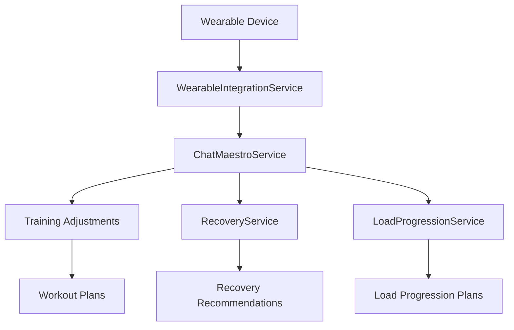

# Integración de Wearables en SPARTAN 4

## Descripción General

La integración de wearables en SPARTAN 4 permite procesar datos de dispositivos como Garmin, Apple Watch, Fitbit y Oura para ajustar automáticamente los parámetros de entrenamiento, incluyendo intensidad, volumen y descansos. Chat Maestro interpreta estos datos y los traduce en ajustes prácticos para el día a día.

## Arquitectura del Sistema

### Componentes Principales

1. **WearableIntegrationService** - Procesa los datos de dispositivos wearables
2. **ChatMaestroService** - Interpreta los datos procesados y genera recomendaciones
3. **RecoveryService** - Analiza métricas de recuperación
4. **LoadProgressionService** - Ajusta la progresión de cargas basada en datos

### Flujo de Datos



## Métricas Procesadas

### 1. HRV (Variabilidad de la Frecuencia Cardíaca)
- **Rango Óptimo**: >70 ms
- **Ajustes**: 
  - HRV <45 ms: Reducir intensidad en 20%, volumen en 25%
  - HRV >75 ms: Aumentar intensidad en 10%

### 2. Sueño
- **Calidad del Sueño**: Escala 1-100
- **Ajustes**:
  - Calidad <50: Reducir duración del entrenamiento en 30%
  - Calidad <50: Aumentar descansos en 25%

### 3. Frecuencia Cardíaca en Reposo
- **Rango Óptimo**: 40-60 bpm
- **Ajustes**:
  - RHR >75: Reducir intensidad en 15%
  - RHR >85: Recomendar día de descanso

### 4. Pasos Diarios
- **Objetivo**: >10,000 pasos
- **Ajustes**:
  - <5,000 pasos: Recomendar actividad adicional

### 5. Calorías Quemadas
- **Ajustes basados en déficit/calorías consumidas**

### 6. Recuperación (Readiness Score)
- **Dispositivos**: Oura, Whoop
- **Ajustes**:
  - <40: Día de descanso completo
  - >85: Aumentar intensidad en 15%

## Cómo Chat Maestro Interpreta los Datos

### Análisis de Preparación para Entrenar

Chat Maestro evalúa múltiples métricas para determinar la preparación del usuario:

1. **Estado de Recuperación**: Basado en HRV, sueño y frecuencia cardíaca en reposo
2. **Carga de Entrenamiento**: Comparando carga actual con capacidad de recuperación
3. **Factores de Riesgo**: Identificando posibles problemas de salud o sobreentrenamiento

### Generación de Recomendaciones

```typescript
// Ejemplo de recomendación generada
const recommendation = {
  type: 'intensity',
  value: -20, // Reducir intensidad en 20%
  reason: 'Bajo HRV indica estrés fisiológico elevado',
  confidence: 0.9,
  metrics: ['hrv']
};
```

### Ajustes Prácticos

1. **Intensidad**: Ajuste de pesos, RPE o porcentaje de 1RM
2. **Volumen**: Cambio en número de series o ejercicios
3. **Duración**: Modificación de la duración del entrenamiento
4. **Descansos**: Ajuste de tiempos entre series
5. **Frecuencia**: Modificación de días de entrenamiento por semana

## Implementación Técnica

### Servicio de Integración de Wearables

```typescript
class WearableIntegrationService {
  processWearableData(userId: string, wearableData: WearableData): WearableInsights {
    // Analiza métricas y genera ajustes
    return insights;
  }
  
  generateTrainingAdjustments(wearableData: WearableData): TrainingAdjustment[] {
    // Genera ajustes específicos basados en métricas
    return adjustments;
  }
}
```

### Integración con Chat Maestro

```typescript
// En ChatMaestroService
private handleWearableBasedAdvice(input: string, context: ChatContext): ChatResponse {
  if (!context.wearableInsights) {
    return {
      response: 'No tengo datos de dispositivos wearables para analizar.'
    };
  }
  
  // Genera respuesta basada en insights de wearables
  return response;
}
```

## Casos de Uso

### 1. Usuario con Bajo HRV
**Escenario**: HRV <45 ms
**Respuesta de Chat Maestro**: 
> "Detecto que tu HRV es bajo ({{hrv}} ms), lo que indica estrés fisiológico elevado. Te recomiendo reducir la intensidad de tu entrenamiento en un 20% y el volumen en un 25% para permitir una mejor recuperación."

### 2. Usuario con Mala Calidad de Sueño
**Escenario**: Calidad del sueño <50
**Respuesta de Chat Maestro**:
> "Tu calidad de sueño ha sido baja ({{sleepQuality}}/100). Te recomiendo acortar tu entrenamiento en un 30% y aumentar los descansos entre series en un 25% para no sobrecargar tu sistema."

### 3. Usuario con Alta Preparación
**Escenario**: Readiness Score >85
**Respuesta de Chat Maestro**:
> "¡Excelentes métricas! Tu puntuación de preparación es {{readiness}}/100. Estás listo para un entrenamiento de alta intensidad. Considera aumentar las cargas en un 15%."

## Beneficios del Sistema

1. **Personalización Avanzada**: Ajustes automáticos basados en datos biométricos reales
2. **Prevención de Sobreentrenamiento**: Detección temprana de signos de fatiga
3. **Optimización del Rendimiento**: Maximización de adaptaciones basada en recuperación
4. **Seguridad**: Identificación de factores de riesgo cardiovasculares y metabólicos
5. **Motivación**: Feedback constante y orientación personalizada

## Métricas de Seguimiento

### Recuperación
- HRV diario
- Frecuencia cardíaca en reposo
- Calidad del sueño
- Puntuación de recuperación

### Rendimiento
- VO2 Max
- Carga de entrenamiento
- Tiempo en zona cardíaca
- Potencia de salida

### Salud
- Presión arterial
- Glucosa en sangre
- Niveles de inflamación
- Hidratación

## Futuras Mejoras

1. **Integración con Más Dispositivos**: Ampliación a nuevos wearables
2. **Aprendizaje Automático**: Mejora continua de algoritmos de análisis
3. **Predicciones Avanzadas**: Modelos predictivos para optimizar entrenamiento
4. **Integración con Nutrición**: Ajustes dietéticos basados en métricas
5. **Interfaz Avanzada**: Visualizaciones más detalladas de datos biométricos

## Conclusión

La integración de wearables en SPARTAN 4 representa un avance significativo en la personalización del entrenamiento. Al combinar datos biométricos en tiempo real con inteligencia artificial avanzada, Chat Maestro puede proporcionar recomendaciones altamente personalizadas que optimizan el rendimiento mientras previenen lesiones y sobreentrenamiento.