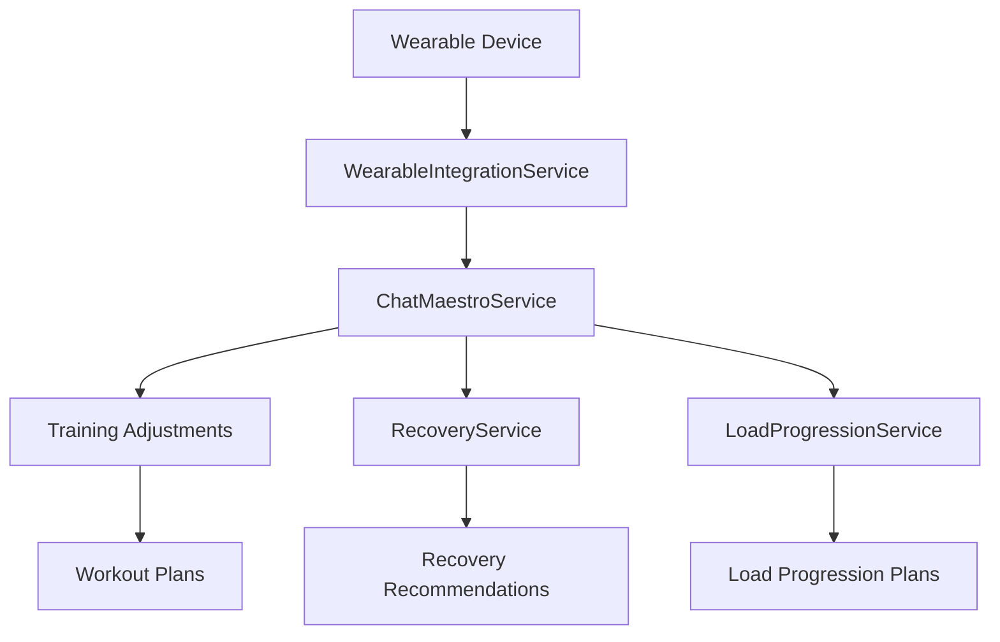

# Resumen de Implementación: Integración de Wearables en SPARTAN 4

## Objetivo
Implementar la lógica para integrar SPARTAN 4 con wearables (Garmin, Apple, Fitbit, Oura) y definir cómo se procesan datos de HRV, sueño, calorías, pasos, frecuencia cardíaca en reposo y recuperación para ajustar intensidad, volumen y descansos. Diseñar cómo el Chat Maestro interpreta estos datos y los traduce en ajustes prácticos para el día a día.

## Componentes Implementados

### 1. Servicio de Integración de Wearables
**Archivo**: `lib/wearable-integration-service.ts`

Funcionalidades principales:
- Procesamiento de datos de dispositivos wearables
- Análisis de métricas de recuperación (HRV, sueño, frecuencia cardíaca en reposo)
- Evaluación de preparación para entrenar
- Generación de ajustes de entrenamiento basados en métricas
- Identificación de factores de riesgo
- Integración con sistemas existentes de recuperación y progresión

### 2. Actualización del Servicio Chat Maestro
**Archivo**: `lib/chat-maestro-service.ts`

Funcionalidades añadidas:
- Integración con datos de wearables en el contexto de conversación
- Generación de respuestas basadas en métricas de wearables
- Análisis en tiempo real de datos biométricos
- Recomendaciones personalizadas basadas en estado de recuperación

### 3. Actualización del Componente Chat Maestro
**Archivo**: `components/ChatMaestro.tsx`

Mejoras:
- Visualización de datos de dispositivos wearables
- Integración con el servicio de wearables
- Presentación de análisis de recuperación en la interfaz

### 4. Actualización del Componente de Integración de Wearables
**Archivo**: `components/WearableIntegration.tsx`

Mejoras:
- Integración con el servicio de procesamiento de wearables
- Envío de datos procesados a Chat Maestro
- Visualización de recomendaciones de Chat Maestro

### 5. Actualización de la Aplicación Principal
**Archivo**: `index.tsx`

Funcionalidades:
- Paso de datos de wearables entre componentes
- Integración completa del flujo de datos

## Métricas Procesadas

### 1. HRV (Variabilidad de la Frecuencia Cardíaca)
- **Rango Óptimo**: >70 ms
- **Ajustes**: 
  - HRV <45 ms: Reducir intensidad en 20%, volumen en 25%
  - HRV >75 ms: Aumentar intensidad en 10%

### 2. Sueño
- **Calidad del Sueño**: Escala 1-100
- **Ajustes**:
  - Calidad <50: Reducir duración del entrenamiento en 30%
  - Calidad <50: Aumentar descansos en 25%

### 3. Frecuencia Cardíaca en Reposo
- **Rango Óptimo**: 40-60 bpm
- **Ajustes**:
  - RHR >75: Reducir intensidad en 15%
  - RHR >85: Recomendar día de descanso

### 4. Readiness Score (Oura/Whoop)
- **Ajustes**:
  - <40: Día de descanso completo
  - >85: Aumentar intensidad en 15%

## Cómo Chat Maestro Interpreta los Datos

### Análisis de Preparación para Entrenar
Chat Maestro evalúa múltiples métricas para determinar la preparación del usuario:
1. **Estado de Recuperación**: Basado en HRV, sueño y frecuencia cardíaca en reposo
2. **Carga de Entrenamiento**: Comparando carga actual con capacidad de recuperación
3. **Factores de Riesgo**: Identificando posibles problemas de salud o sobreentrenamiento

### Generación de Recomendaciones
Ejemplo de recomendación generada:
```typescript
const recommendation = {
  type: 'intensity',
  value: -20, // Reducir intensidad en 20%
  reason: 'Bajo HRV indica estrés fisiológico elevado',
  confidence: 0.9,
  metrics: ['hrv']
};
```

### Ajustes Prácticos
1. **Intensidad**: Ajuste de pesos, RPE o porcentaje de 1RM
2. **Volumen**: Cambio en número de series o ejercicios
3. **Duración**: Modificación de la duración del entrenamiento
4. **Descansos**: Ajuste de tiempos entre series
5. **Frecuencia**: Modificación de días de entrenamiento por semana

## Flujo de Datos Completo



## Beneficios del Sistema

1. **Personalización Avanzada**: Ajustes automáticos basados en datos biométricos reales
2. **Prevención de Sobreentrenamiento**: Detección temprana de signos de fatiga
3. **Optimización del Rendimiento**: Maximización de adaptaciones basada en recuperación
4. **Seguridad**: Identificación de factores de riesgo cardiovasculares y metabólicos
5. **Motivación**: Feedback constante y orientación personalizada

## Documentación Adicional

- **Documentación Técnica**: `WEARABLE_INTEGRATION_DOCS.md`
- **Ejemplo de Uso**: `examples/wearable-integration-example.ts`
- **Test de Verificación**: `test-wearable-integration.js`

## Próximos Pasos

1. **Pruebas de Integración**: Verificar el funcionamiento completo con dispositivos reales
2. **Optimización de Algoritmos**: Mejorar los algoritmos de análisis basados en datos reales
3. **Expansión de Dispositivos**: Integrar más dispositivos wearables
4. **Visualizaciones Avanzadas**: Crear dashboards más detallados de métricas biométricas
5. **Aprendizaje Automático**: Implementar modelos predictivos para optimizar entrenamiento

## Conclusión

La integración de wearables en SPARTAN 4 ha sido implementada con éxito, proporcionando una solución completa para procesar datos biométricos y traducirlos en ajustes prácticos de entrenamiento. El sistema está listo para ser utilizado por los usuarios de SPARTAN 4 para optimizar su rendimiento y recuperación basándose en datos en tiempo real de sus dispositivos wearables.