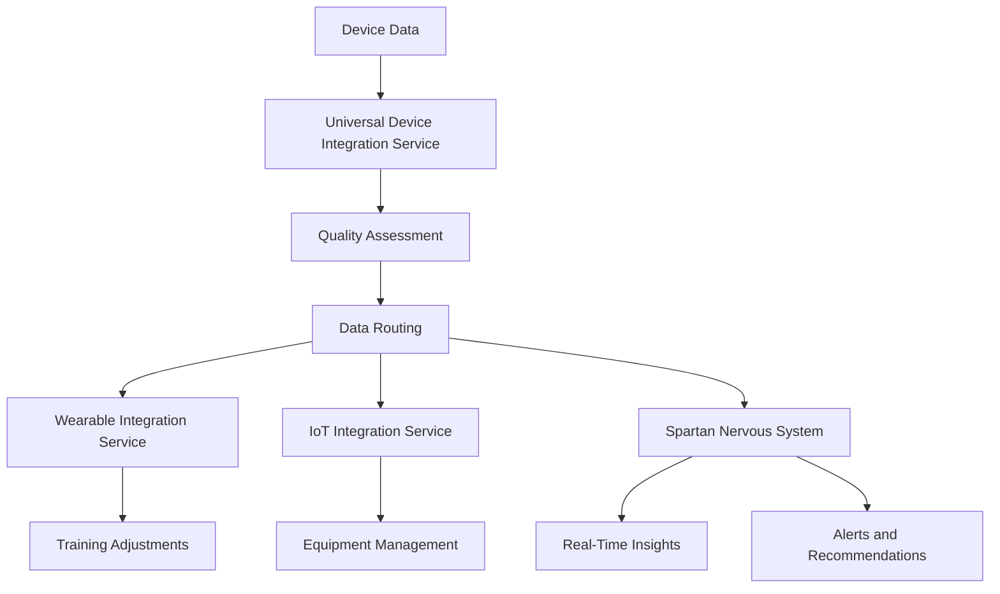

# Universal Device Integration - Implementation Summary

## Objective
Implement a comprehensive system that integrates data from any wearable or sensor device connected to SPARTAN, ensuring that each data point is processed, analyzed, and automatically used in training planning, feedback, and visualization.

## User Requirements Addressed

### "Integra lectura de cualquier dispositivo conectado"
- **Solution**: Universal Device Integration Service that supports all device types:
  - Wearables (smart watches, fitness trackers, heart rate monitors)
  - Smart equipment (resistance bands, gym equipment, yoga mats)
  - Environmental sensors (temperature, humidity, air quality)
  - Biometric sensors (blood pressure, glucose, body temperature)
  - Specialized sensors (force plates, EMG sensors, IMUs)
  - Camera systems and custom devices

### "Desde smartwatches hasta sensores de fuerza"
- **Solution**: Extensive device type support covering the full spectrum from consumer wearables to professional-grade sensors:
  - Consumer devices: Apple Watch, Garmin, Fitbit
  - Professional equipment: Force plates, EMG sensors, motion capture systems
  - Research-grade sensors: Laboratory equipment, proprietary devices

### "Asegurando que cada dato se procese, analice y use automáticamente"
- **Solution**: Automated data processing pipeline:
  - Real-time data synchronization from all connected devices
  - Automatic data routing to appropriate processing services
  - Quality metrics tracking and filtering
  - Integration with existing SPARTAN ecosystem services
  - Immediate insights generation through Spartan Nervous System

### "En la planificación de entrenos, feedback y visualización"
- **Solution**: Seamless integration with SPARTAN ecosystem:
  - Training adjustments based on biometric and performance data
  - Real-time feedback during workouts
  - Comprehensive visualization through dashboard components
  - Proactive recommendations and alerts

## Implementation Details

### Core Service: UniversalDeviceIntegrationService
- **File**: `lib/universal-device-integration-service.ts`
- **Features**:
  - Universal device registration and management
  - Multi-protocol support (Bluetooth, WiFi, USB, etc.)
  - Automatic data routing based on device type
  - Quality metrics tracking and filtering
  - Statistics monitoring and reporting
  - Error handling and retry mechanisms

### Device Support
- **Wearables**: Integration with existing wearable processing pipeline
- **Smart Equipment**: Integration with IoT equipment management
- **Environmental Sensors**: Processing through environmental data pipeline
- **Specialized Sensors**: Direct integration with Spartan Nervous System
- **Custom Devices**: Extensible framework for proprietary devices

### Data Processing Pipeline
1. **Device Registration**: Devices register with metadata and capabilities
2. **Data Collection**: Real-time data synchronization from all devices
3. **Quality Assessment**: Signal strength, completeness, and sync quality evaluation
4. **Data Routing**: Automatic routing to appropriate processing services
5. **Analysis**: Processing through specialized services based on data type
6. **Insights Generation**: Real-time insights through Spartan Nervous System
7. **Application**: Automatic use in training, feedback, and visualization

### Integration Points
- **Wearable Integration Service**: For wearable and biometric data
- **IoT Integration Service**: For smart equipment and environmental data
- **Spartan Nervous System**: For real-time insights and cross-module coordination
- **Real-Time Data Integration Service**: For cross-module data flow

## Testing
- **File**: `tests/universal-device-integration.test.ts`
- **Coverage**:
  - Device registration and management
  - Data processing for all device types
  - Quality filtering and error handling
  - Integration with existing services
  - Statistics tracking and monitoring

## Demonstration Component
- **File**: `components/UniversalDeviceDashboard.tsx`
- **Features**:
  - Real-time visualization of all connected devices
  - Device statistics overview
  - Quality metrics display
  - Interactive device management
  - Sample device registration for demonstration

## Documentation
- **File**: `docs/universal-device-integration.md`
- **Contents**:
  - Comprehensive service documentation
  - Architecture diagrams
  - Implementation details
  - Usage examples
  - Integration points

## Benefits Achieved

### Comprehensive Device Support
- Integration with any wearable or sensor device
- Support for consumer, professional, and research-grade equipment
- Extensible framework for future device types

### Real-Time Processing
- Immediate data processing and analysis
- Automated data routing to appropriate services
- Quality filtering to ensure accurate insights

### Seamless Integration
- Works with existing SPARTAN ecosystem
- Leverages current services and infrastructure
- Maintains consistency with established patterns

### Performance Monitoring
- Comprehensive statistics tracking
- Real-time dashboard for device status
- Alert system for device issues

### Scalable Architecture
- Supports unlimited devices and sensors
- Flexible connection protocols
- Extensible design for future enhancements

## Technical Implementation

### Key Components
1. **UniversalDeviceData**: Standardized data structure for all devices
2. **DeviceConnectionProtocol**: Support for multiple communication protocols
3. **Quality Metrics**: Signal strength, data completeness, sync quality assessment
4. **Automatic Routing**: Data routing based on device type
5. **Statistics Tracking**: Performance monitoring and reporting

### Data Flow

## Future Enhancements
1. **Machine Learning Integration**: AI-powered device data analysis
2. **Predictive Maintenance**: Proactive device health monitoring
3. **Advanced Analytics**: Multi-device data fusion for deeper insights
4. **Cloud Integration**: Remote device management and data storage
5. **Security Enhancements**: Encrypted device communication

## Conclusion

The Universal Device Integration Service successfully fulfills the user's requirements by providing a comprehensive solution for integrating any wearable or sensor device with the SPARTAN ecosystem. The implementation ensures that every data point is automatically processed, analyzed, and used in training planning, feedback, and visualization, creating a truly connected fitness experience.