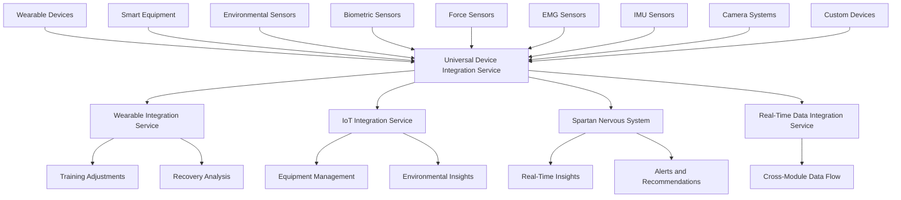

# Universal Device Integration Service

## Overview

The Universal Device Integration Service is a comprehensive solution for integrating any wearable or sensor device with the SPARTAN 4 ecosystem. This service extends the existing IoT and wearable integration capabilities to support a broader range of devices and sensors, ensuring that every data point is collected, processed, and utilized automatically in training planning, feedback, and visualization.

## Features

### 1. Universal Device Support
- Support for all types of devices: wearables, smart equipment, environmental sensors, biometric sensors, force sensors, EMG sensors, IMU sensors, camera systems, and custom devices
- Multiple connection protocols: Bluetooth, WiFi, USB, Serial, MQTT, WebSocket, HTTP, and custom protocols
- Automatic device discovery and registration
- Device metadata management (manufacturer, model, firmware version, capabilities)

### 2. Data Processing and Analysis
- Real-time data synchronization from all connected devices
- Quality metrics tracking (signal strength, data completeness, synchronization quality, battery level)
- Automatic data routing to appropriate processing services based on device type
- Error handling and retry mechanisms
- Configurable quality thresholds to filter low-quality data

### 3. Integration with SPARTAN Ecosystem
- Seamless integration with existing wearable integration service
- Compatibility with IoT integration service for smart equipment and environmental sensors
- Real-time data flow to Spartan Nervous System for immediate insights
- Synchronization with real-time data integration service for cross-module communication

### 4. Comprehensive Monitoring
- Device statistics tracking (total devices, connected devices, data points processed)
- Performance metrics (average quality, error count, last sync time)
- Real-time dashboard for device status visualization
- Alert system for device issues (low battery, poor signal, sync problems)

## Architecture



## Device Types

### Wearables
- Smart watches (Apple Watch, Garmin, Fitbit, etc.)
- Fitness trackers
- Heart rate monitors
- Sleep trackers
- GPS devices

### Smart Equipment
- Smart resistance bands
- Connected gym equipment
- Smart yoga mats
- Intelligent dumbbells and barbells

### Environmental Sensors
- Temperature sensors
- Humidity sensors
- Air quality monitors
- Atmospheric pressure sensors
- Light sensors

### Biometric Sensors
- Blood pressure monitors
- Glucose meters
- Body temperature sensors
- Hydration sensors

### Specialized Sensors
- Force plates and load cells
- Electromyography (EMG) sensors
- Inertial Measurement Units (IMUs)
- High-speed cameras and motion capture systems

### Custom Devices
- Research-grade sensors
- Laboratory equipment
- Proprietary devices with custom protocols

## Implementation

### Core Components

#### 1. UniversalDeviceIntegrationService
The main service that handles all device integration functionality:
- Device registration and management
- Data processing and routing
- Quality metrics tracking
- Statistics monitoring
- Configuration management

#### 2. Type Definitions
Comprehensive type definitions for all device integration components:
- Universal device data structures
- Device connection protocols
- Quality metrics
- Integration configuration
- Statistics tracking

### Key Algorithms

#### Device Data Routing
The service automatically routes incoming device data to the appropriate processing service based on device type:
- Wearable and biometric sensor data → Wearable Integration Service
- Smart equipment data → IoT Integration Service
- Environmental sensor data → IoT Integration Service
- Specialized sensor data (force, EMG, IMU) → Direct to Nervous System
- Camera systems → Direct to Nervous System
- Custom devices → Direct to Nervous System

#### Quality Filtering
Data quality is assessed using multiple metrics:
- Signal strength (0-100)
- Data completeness (0-100)
- Synchronization quality (excellent, good, fair, poor)
- Battery level (0-100, when available)

Data below the configured quality threshold is filtered out to prevent inaccurate analysis.

## Integration Points

### Spartan Nervous System
All processed device data is sent to the Spartan Nervous System for:
- Real-time insights generation
- Alert and recommendation creation
- Cross-module data coordination
- Proactive system behavior

### Existing Services
The service integrates with existing SPARTAN services:
- Wearable Integration Service for wearable and biometric data
- IoT Integration Service for smart equipment and environmental data
- Real-Time Data Integration Service for cross-module communication

## Usage

### Device Registration
```typescript
import { universalDeviceIntegrationService } from './universal-device-integration-service';

// Register a new device
const deviceData = {
  deviceId: 'apple-watch-001',
  deviceName: 'Apple Watch Series 8',
  deviceType: 'wearable',
  protocol: 'bluetooth',
  rawData: {
    heartRate: 72,
    steps: 8432
  },
  processedData: {
    heartRate: 72,
    steps: 8432
  },
  qualityMetrics: {
    signalStrength: 92,
    dataCompleteness: 98,
    synchronizationQuality: 'excellent',
    batteryLevel: 78
  },
  metadata: {
    manufacturer: 'Apple',
    model: 'Series 8',
    firmwareVersion: '9.1',
    capabilities: ['heart_rate', 'steps', 'calories', 'sleep_tracking', 'gps']
  }
};

universalDeviceIntegrationService.registerDevice(deviceData);
```

### Configuration
```typescript
// Configure integration settings
universalDeviceIntegrationService.configure({
  autoDiscovery: true,
  dataSyncInterval: 5000, // 5 seconds
  qualityThreshold: 70, // Minimum quality to process data
  retryAttempts: 3,
  fallbackProtocols: ['bluetooth', 'wifi', 'usb']
});
```

### Monitoring
```typescript
// Get device statistics
const stats = universalDeviceIntegrationService.getStats();
console.log(`Connected devices: ${stats.connectedDevices}`);
console.log(`Average data quality: ${stats.averageQuality}%`);

// Get all registered devices
const devices = universalDeviceIntegrationService.getDevices();
devices.forEach(device => {
  console.log(`${device.deviceName}: ${device.qualityMetrics.signalStrength}% signal`);
});
```

## Benefits

1. **Comprehensive Device Support**: Integration with any wearable or sensor device
2. **Real-Time Processing**: Immediate data processing and analysis
3. **Quality Assurance**: Automatic filtering of low-quality data
4. **Seamless Integration**: Works with existing SPARTAN ecosystem
5. **Scalable Architecture**: Supports unlimited devices and sensors
6. **Flexible Protocols**: Multiple connection options for different devices
7. **Extensible Design**: Easy to add support for new device types
8. **Performance Monitoring**: Comprehensive statistics and monitoring

## Testing

The service includes a comprehensive test suite that verifies:
- Device registration and management
- Data processing for all device types
- Quality filtering and error handling
- Integration with existing services
- Statistics tracking and monitoring

## Future Enhancements

1. **Machine Learning Integration**: AI-powered device data analysis
2. **Predictive Maintenance**: Proactive device health monitoring
3. **Advanced Analytics**: Deeper insights from multi-device data fusion
4. **Cloud Integration**: Remote device management and data storage
5. **Edge Computing**: On-device processing for reduced latency
6. **Security Enhancements**: Encrypted device communication
7. **API Integration**: Third-party device integration via APIs

## Related Components

- [IoT Integration Service](./iot-integration-service.ts)
- [Wearable Integration Service](./wearable-integration-service.ts)
- [Spartan Nervous System](./spartan-nervous-system.ts)
- [Real-Time Data Integration Service](./real-time-data-integration.ts)